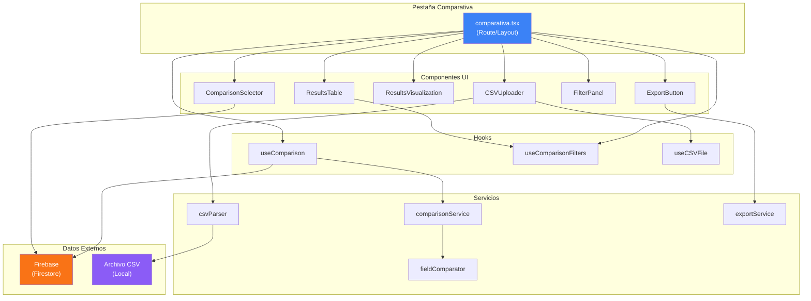
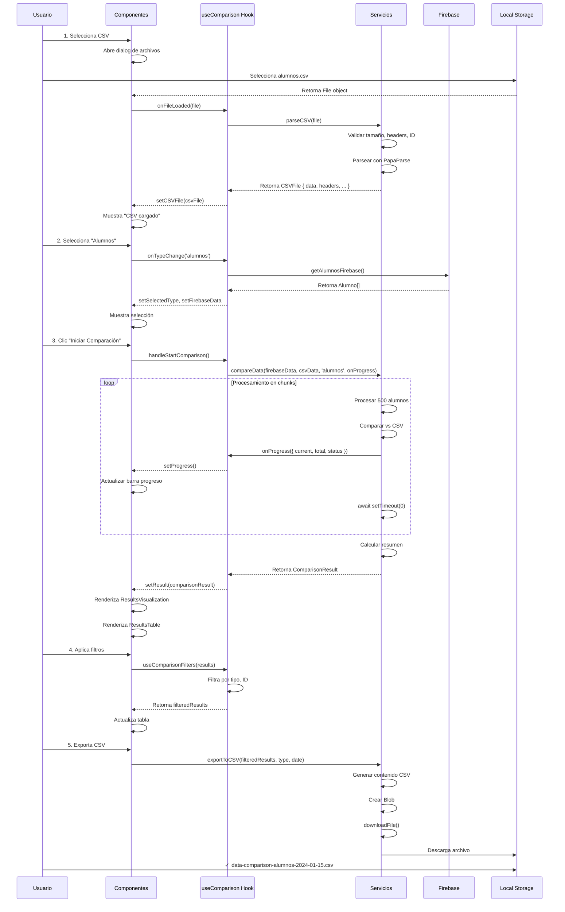
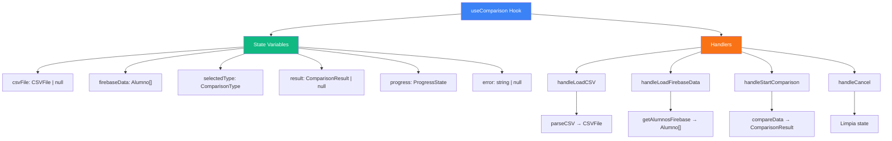
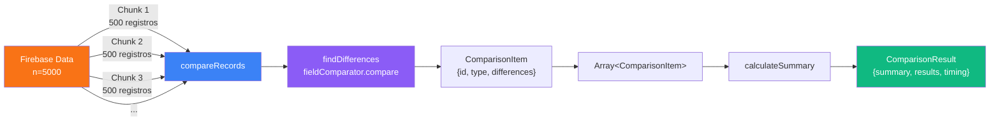
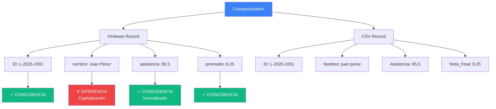
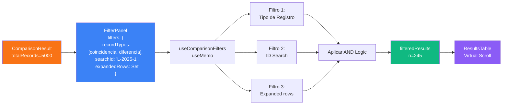
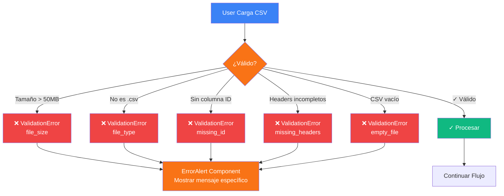
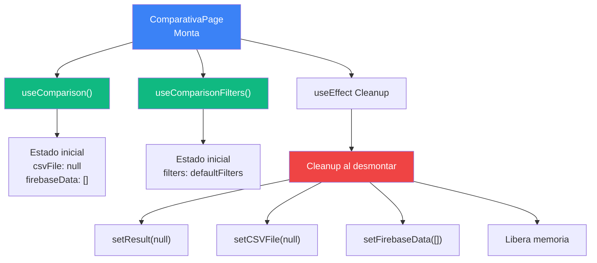
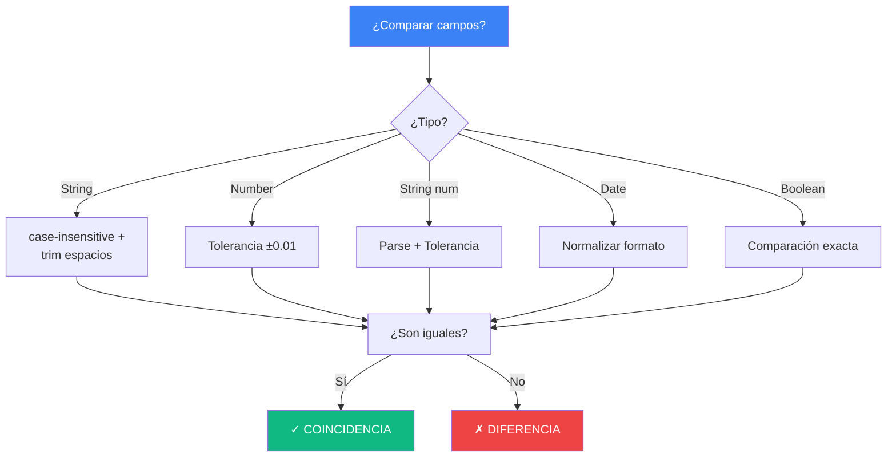
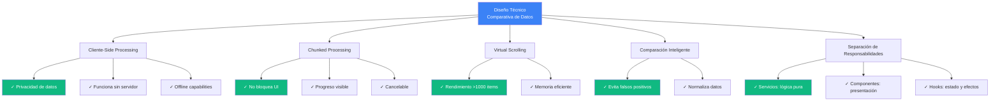

# Diagramas de Arquitectura - Comparativa de Datos

## 1. Diagrama de Componentes



## 2. Flujo de Datos Completo



## 3. Estructura de Estado en useComparison



## 4. Procesamiento de Comparación en Chunks



## 5. Tabla de Comparación de Campos



## 6. Flujo de Filtrado



## 7. Validación y Manejo de Errores



## 8. Ciclo de Vida de Componente



## 9. Matriz de Decisión: Comparación Inteligente



## 10. Timeline de Procesamiento

```
CSV Cargado: 0ms
├─ Parse: 50ms
├─ Validación: 20ms
└─ Listo: 70ms

Firebase Data Cargado: 100ms
├─ Query: 80ms
├─ Mapeo: 20ms
└─ Listo: 100ms

Comparación Iniciada: 200ms
├─ Chunk 1 (0-500): 250ms ▓▓░░░░░░░░ (10%)
├─ Chunk 2 (500-1000): 250ms ▓▓▓▓░░░░░░ (20%)
├─ Chunk 3 (1000-1500): 250ms ▓▓▓▓▓▓░░░░ (30%)
├─ Chunk 4 (1500-2000): 250ms ▓▓▓▓▓▓▓▓░░ (40%)
├─ Chunk 5 (2000-2500): 250ms ▓▓▓▓▓▓▓▓▓░ (50%)
├─ ...
├─ Chunk 10 (4500-5000): 250ms ▓▓▓▓▓▓▓▓▓▓ (100%)
└─ Total: ~2500ms (2.5s)

Resumen Calculado: 2700ms
Export CSV: 2800ms

Total: ~2.8s para 5000 registros
```

## 11. Decisiones de Diseño



